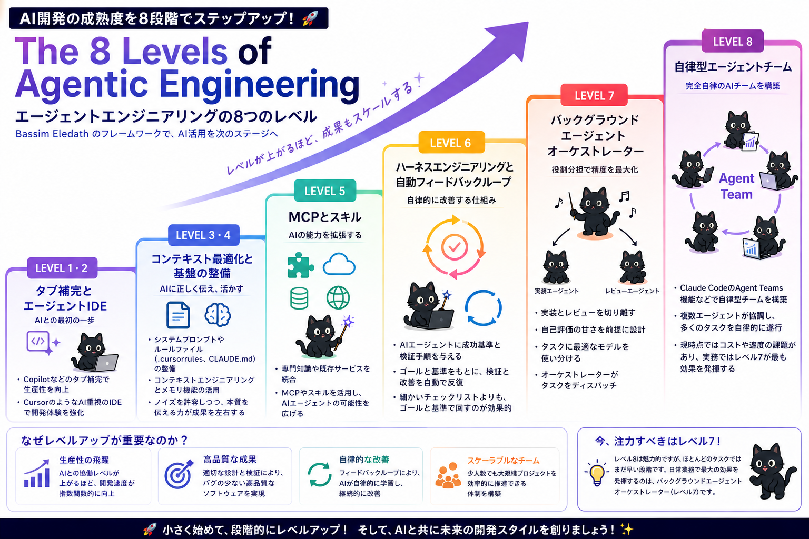

# The 8 Levels of Agentic Engineering

## 要点（3行サマリ）

- Bassim Eledath が提唱する **AI開発成熟度モデル**。AIを活用した開発の習熟度を 8 段階で整理したフレームワーク。
- 段階は「補完ツール（Lv1-2）→ コンテキスト整備（Lv3-4）→ MCP/スキル（Lv5）→ ハーネス＋自動フィードバックループ（Lv6）→ オーケストレーション（Lv7）→ 自律型エージェントチーム（Lv8）」と進む。
- 「小さく始めて段階的にレベルアップする」のがコア思想。一足飛びにLv8を目指すのではなく、いま自分がどこにいるかを見極めて次の段階を試行する。

## 出典

- 著者: **Bassim Eledath**
- 表題: *The 8 Levels of Agentic Engineering*
- 形式: フレームワーク図（日本語訳バージョンを保管）
- ローカル保存: [`./cover.png`](./cover.png)

## 8レベルの要約

### LEVEL 1・2 — タブ補完とエージェントIDE

- AI との出会い。Copilot や Cursor 等で「タブで補完する」「IDE上でAIに依頼する」段階。
- 主役は IDE。AI はあくまで **補助** として動く。

### LEVEL 3・4 — コンテキスト最適化と基盤の整備

- システムプロンプト・ルールファイル（`.cursorrules`, `CLAUDE.md` 等）を整備し、AI に正しく伝わる土台を作る。
- ノイズを排除し、AIが参照すべき情報を絞り込むフェーズ。
- ここを飛ばすと、上位レベルに行ってもアウトプットが安定しない。

### LEVEL 5 — MCP とスキル

- 専門知識付きサービスの活用、MCPサーバーをかませて AI の **能力を拡張**する。
- 単なる補完を超えて、外部ツール・データソースに接続することで「できること」が一段増える。

### LEVEL 6 — ハーネスエンジニアリングと自動フィードバックループ

- AI エージェントに **成功の基準**と **ゴール**を与え、自律的にチェックリストや改善を回す仕組みを作る。
- AI を単発で使うのではなく、ハーネス（足場）を組んで **継続的に動かす**段階。
- 自動フィードバックループによって、人間の関与頻度を下げる。

### LEVEL 7 — バックグラウンドエージェント／オーケストレーター

- 役割を分担した複数のエージェントが協調して動く。実装エージェント・レビューエージェントなど。
- タスクに最適なエージェントを **オーケストレーターが分配**する。
- 自己評価と改善のループも回るようになる。

### LEVEL 8 — 自律型エージェントチーム

- Claude Code 等の Agent Teams 機能で、複数のエージェントが協調し、多くのタスクを **自律的にこなす**段階。
- 同時並列のタスク実行・ハンドオフが効率良く回る。完全自律のAIチームを構築するゴール地点。

## 自分の現在地と次の一手

> 後で記入する：
> - いま自分はレベル何にいるか（例: Lv6 を運用しつつ Lv7 を試行中）
> - その判断根拠（実プロジェクトでの具体例 / 自動化されている部分の範囲）
> - 次のレベルに上がるために試したいこと（フックの再設計、サブエージェント並列化、MCP拡充 等）

## このフレームワークを引用するとき

- 動画の言い回し例: 「Bassim Eledath の **8 Levels of Agentic Engineering** で言うと、私はいまレベル○にいて、レベル◎を試行中です」
- 記事での参照: 著者名と原典タイトルを併記し、本ファイル `agentic-engineering/the-8-levels-of-agentic-engineering/README.md` を一次の **自分の解釈** として引用元に出す
- 図そのものを資料に貼るときは Bassim Eledath のクレジットを必ず明記する

## メモ・気づき（時系列）

| 日付 | メモ |
|------|------|
| 2026-05-02 | 記事を発見、要点を整理して骨組み作成 |
