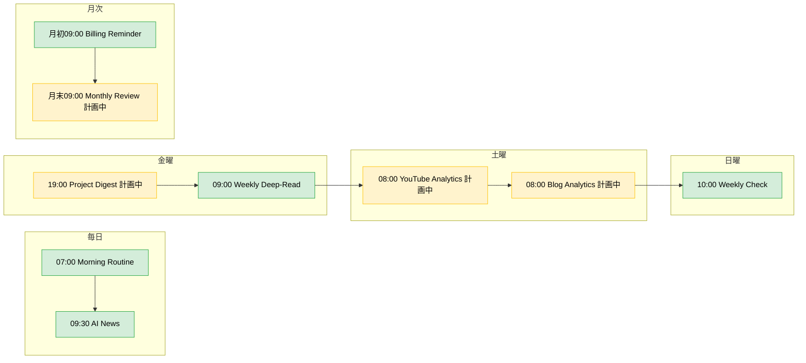

# サイドプロジェクト自動化アーキテクチャ

> 最終更新: 2026-03-30

## 1. システム全体図

```mermaid
graph TB
    subgraph repos["GitHub Repositories"]
        daily["daily/ - 自動化ハブ"]
        ideabox["idea-box/ - アイデア管理"]
        youtube["content/youtube/ - 動画制作"]
        techblog["content/tech-blog/ - テックブログ"]
        life["life/goal/ - 目標管理"]
        dev["dev/ - 開発プロジェクト"]
        m1126["masayan1126/ - ワークフロー管理"]
    end

    subgraph actions_daily["GitHub Actions - daily"]
        morning["morning-routine 毎日07:00"]
        discordnotify["discord-notify 毎日09:30"]
        weekly["weekly-check 日曜10:00"]
        billing["billing-notify 月初09:00"]
        digest["project-digest 金曜19:00 計画中"]
        ytanalytics["youtube-analytics 土曜08:00 計画中"]
    end

    subgraph actions_idea["GitHub Actions - idea-box"]
        autolabel["auto-label Issue作成時"]
        buildsite["build-site Issue変更時"]
    end

    subgraph skills["Claude Code Skills"]
        planner["youtube-content-planner"]
        deeptechinit["deep-tech-init"]
        uploadyt["upload-youtube"]
        calsync["calendar-sync"]
        weeklydeep["weekly-deep-read"]
        planning["planning-session 計画中"]
    end

    subgraph external["External Services"]
        discord["Discord"]
        gcal["Google Calendar"]
        ytapi["YouTube API"]
        ga4["Google Analytics"]
        adsense["AdSense"]
        opmeteo["Open-Meteo API"]
        cfworkers["Cloudflare Workers"]
        gmail["Gmail API"]
        notebooklm["NotebookLM"]
    end

    subgraph local["Local Tools"]
        claudechrome["claude-in-chrome"]
        claudecode["Claude Code CLI"]
    end

    daily --> morning
    daily --> discordnotify
    daily --> weekly
    daily --> billing
    daily -.-> digest
    daily -.-> ytanalytics

    morning -->|天気取得| opmeteo
    morning -->|通知| discord
    discordnotify -->|通知| discord
    weekly -->|通知| discord
    billing -->|通知| discord
    digest -.->|通知| discord
    ytanalytics -.->|通知| discord

    ideabox --> autolabel
    ideabox --> buildsite

    youtube --> planner
    youtube --> deeptechinit
    youtube --> uploadyt
    uploadyt -->|OAuth| ytapi
    ytanalytics -.->|Analytics API| ytapi
    ytanalytics -.->|GA4 API| ga4

    m1126 --> calsync
    calsync -.->|Calendar API| gcal
    claudechrome -->|ブラウザ操作| ga4
    claudechrome -->|ブラウザ操作| adsense

    claudecode --> planner
    claudecode --> calsync
    claudecode --> planning
    claudecode --> weeklydeep

    daily -->|Cloudflare Workers| cfworkers

    m1126 --> weeklydeep
    weeklydeep -->|Gmail API| gmail
    claudechrome -->|ブラウザ操作| notebooklm

    ideabox -.->|アイデア昇格| planner
    planner -.->|roadmap出力| calsync

    classDef planned fill:#fff3cd,stroke:#ffc107,color:#000
    classDef active fill:#d4edda,stroke:#28a745,color:#000
    class digest,ytanalytics,planning planned
    class morning,discordnotify,weekly,billing,autolabel,buildsite,planner,deeptechinit,uploadyt,calsync,weeklydeep active
```

## 2. 自動化タイムライン

## 3. YouTubeプロダクションパイプライン

```mermaid
flowchart LR
    subgraph step1["1. アイデア蓄積"]
        mobile["スマホ Claude App / GitHub App"]
        ideabox["idea-box GitHub Issues"]
        labeled["ラベル付与"]
        mobile -->|Issue作成| ideabox
        ideabox -->|auto-label| labeled
    end

    subgraph step2["2. 精査・仕分け"]
        digest["Discord通知"]
        review["バックログ精査"]
        backlog["backlog.md"]
        labeled -->|金曜ダイジェスト| digest
        digest -->|確認| review
        review -->|昇格| backlog
    end

    subgraph step3["3. スケジューリング"]
        mdtable["マークダウンテーブル生成"]
        gcal["Google Calendar 時間枠予約"]
        backlog -->|roadmapコマンド| mdtable
        mdtable -->|calendar-sync| gcal
    end

    subgraph step4["4. 制作"]
        init["deep-tech-init"]
        gemini["Geminiタブ×4 自動起動\n（サムネイル生成用）"]
        record["Screen Studio 撮影編集"]
        transcript["文字起こし メタデータ生成"]
        upload["upload-youtube"]
        published["backlog.md published"]
        gcal -->|当日実行| init
        init --> gemini
        gemini --> record
        record --> transcript
        transcript --> upload
        upload -->|status更新| published
    end

    subgraph step5["5. 分析・改善"]
        analytics["YouTube Analytics"]
        improve["KPI分析 サムネ改善"]
        analyzed["backlog.md analyzed"]
        published -->|自動通知| analytics
        analytics -->|reviewコマンド| improve
        improve -->|status更新| analyzed
        analyzed -.->|次サイクル| review
    end

    style ideabox fill:#e3f2fd,stroke:#1976d2
    style backlog fill:#fff3e0,stroke:#f57c00
    style gcal fill:#e8f5e9,stroke:#388e3c
    style upload fill:#fce4ec,stroke:#c62828
    style analytics fill:#f3e5f5,stroke:#7b1fa2
```

## 4. Discord通知チャンネル構成

| Webhook Secret | 用途 | 通知内容 |
|---------------|------|---------|
| `MORNING_ROUTINE_WEBHOOK_URL` | 朝ルーティン | 天気、日次タスク |
| `DISCORD_WEBHOOK_URL` | AI News / 課金 | 日次ニュース、月次課金リマインダー |
| `DISCORD_WEEKLY_WEBHOOK_URL` | 週次チェック | アナリティクス確認リマインダー |
| `DISCORD_ANALYTICS_WEBHOOK_URL` (計画中) | アナリティクス | YouTube/ブログの週次レポート |
| `DISCORD_PROJECT_WEBHOOK_URL` (計画中) | プロジェクト管理 | 金曜ダイジェスト、月次レビュー |

## 5. 認証・API構成

| API | スコープ | 認証ファイル | 用途 |
|-----|---------|-------------|------|
| YouTube Data API v3 | `youtube.upload`, `youtube` | `zunda-ai-news/token.json` | 動画アップロード |
| YouTube Analytics API | `yt-analytics.readonly` (計画中) | `masayan1126/token_analytics.json` | 週次レポート |
| Google Calendar API | `calendar.events` | `masayan1126/token_calendar.json` | タスク登録 |
| Google Analytics Data API | `analytics.readonly` (計画中) | `masayan1126/token_analytics.json` | ブログPV |
| AdSense Management API | `adsense.readonly` (計画中) | `masayan1126/token_analytics.json` | 収益レポート |
| Gmail API | `gmail.readonly`, `gmail.labels` (計画中) | `masayan1126/.claude/skills/.../token_gmail.json` (予定) | 週次ディープリード記事URL抽出 |
| Open-Meteo API | (認証不要) | - | 天気予報 |
