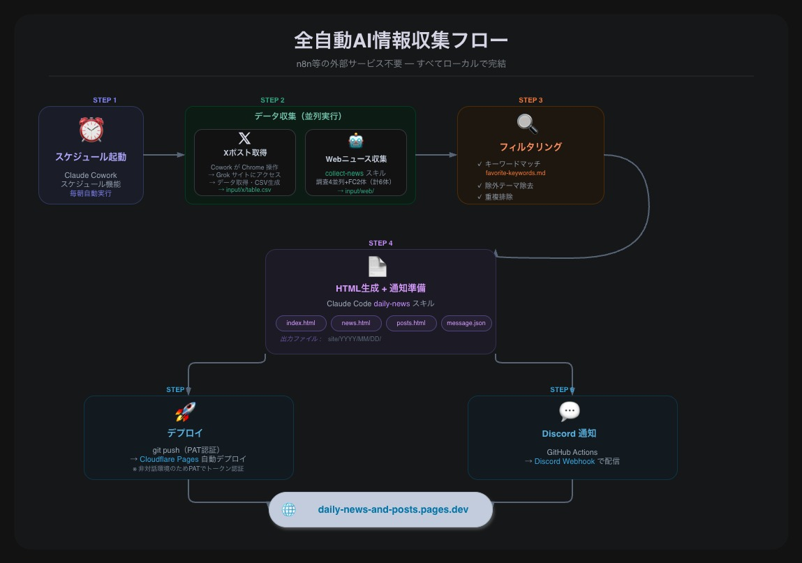
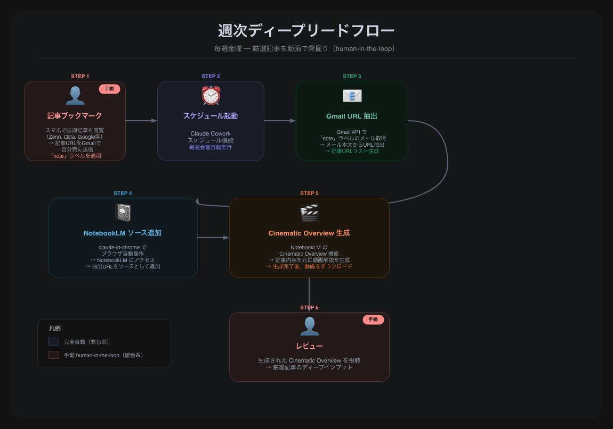

# Auto News Collector - AI情報収集

AI情報収集を自動化するプロジェクト。毎朝の広域ニュース収集（日次・完全自動）と、厳選記事の動画解説生成（週次・半自動）の2フローで構成。

収集したニュースは静的HTMLとして生成し、[Cloudflare Pages](https://daily-news-and-posts.pages.dev) で公開。厳選記事は NotebookLM Cinematic Overview で動画解説化し、ディープインプットに活用。

## フロー図

### 日次ニュース収集フロー

### 週次ディープリードフロー

## 詳細ドキュメント

- [overview.md](overview.md) — プロジェクト概要・目標・技術スタック
- [workflow.md](workflow.md) — 自動化フロー手順の詳細（日次 + 週次）
- [docs/auto-news-flow.drawio.xml](docs/auto-news-flow.drawio.xml) — 日次フロー図の Draw.io 元データ
- [docs/weekly-deep-read-flow.drawio.xml](docs/weekly-deep-read-flow.drawio.xml) — 週次ディープリードフロー図の Draw.io 元データ
