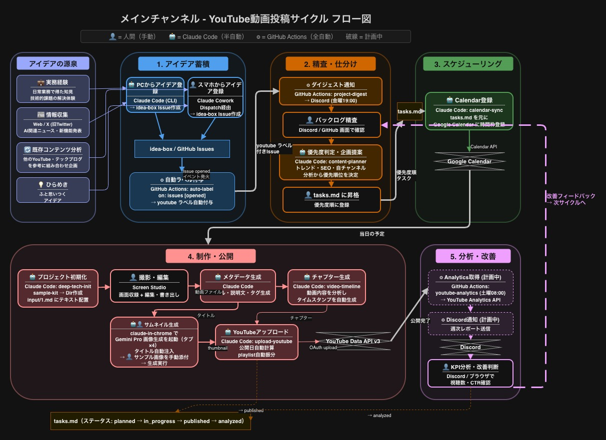

# YouTube チャンネル運営

AI活用・開発自動化の実践チュートリアル動画を制作・公開するチャンネル。収益化（YPP）達成を最優先目標として運営中。

- チャンネル: [@masayan_tech_ai_mcp](https://www.youtube.com/@masayan_tech_ai_mcp)

## フロー図

## 詳細ドキュメント

- [overview.md](overview.md) — プロジェクト概要・目標・現状
- [workflow.md](workflow.md) — 自動化フロー手順の詳細
- [tasks.md](tasks.md) — タスク管理（content-planner による自動生成）
- [docs/](docs/) — Draw.io 元データ・フロー図画像
